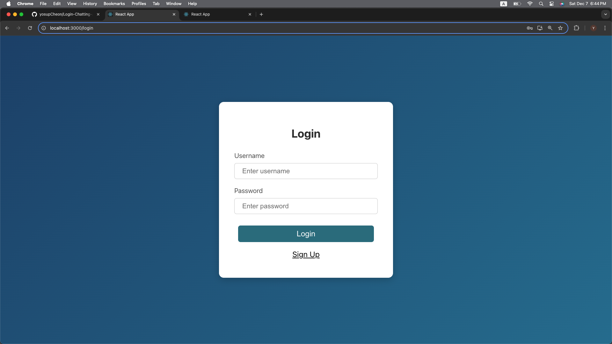
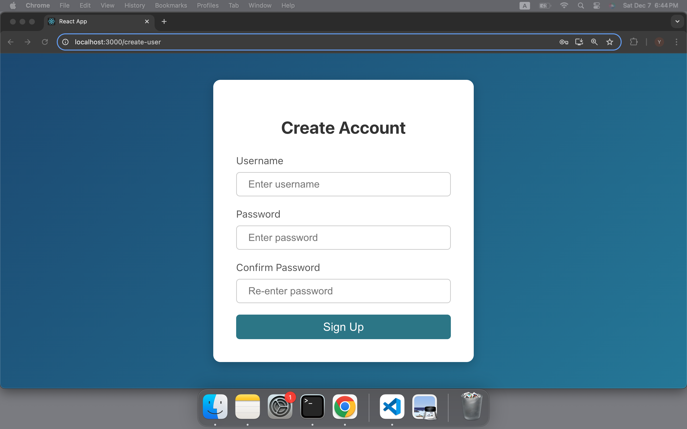
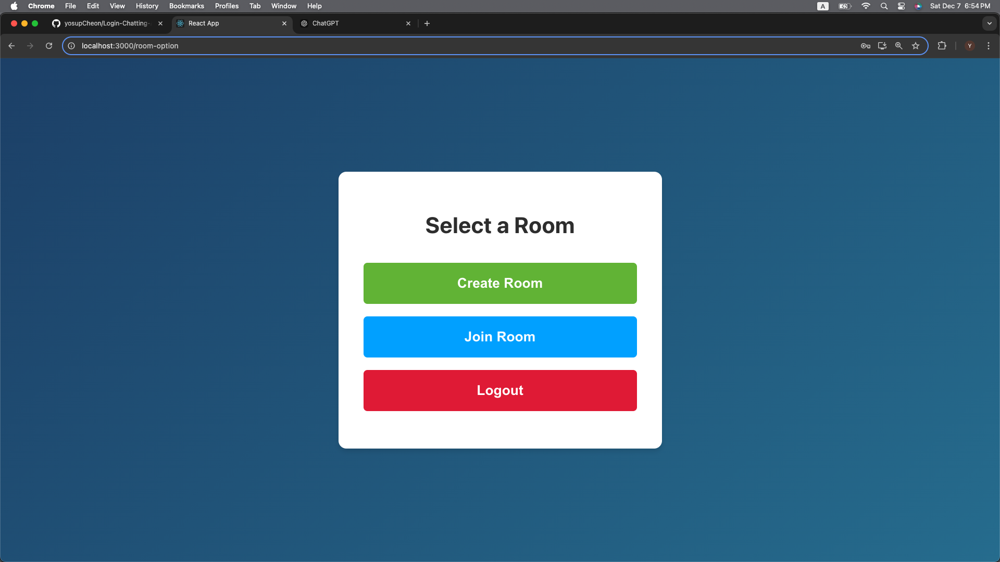
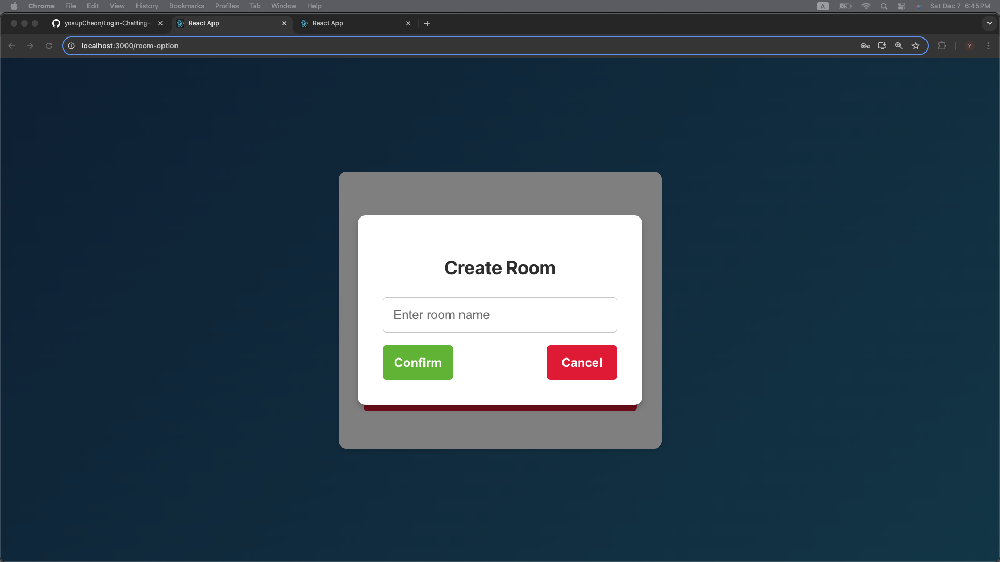
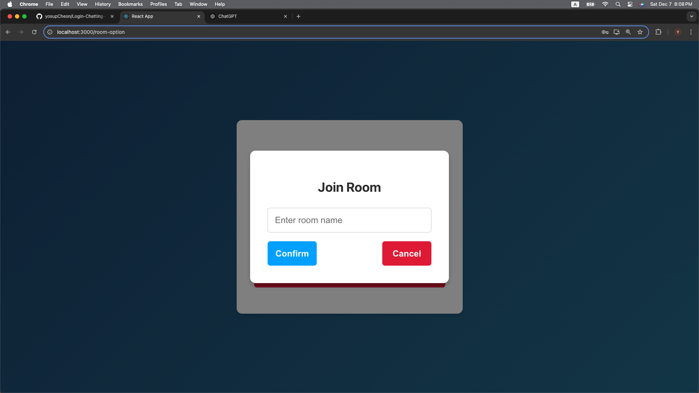
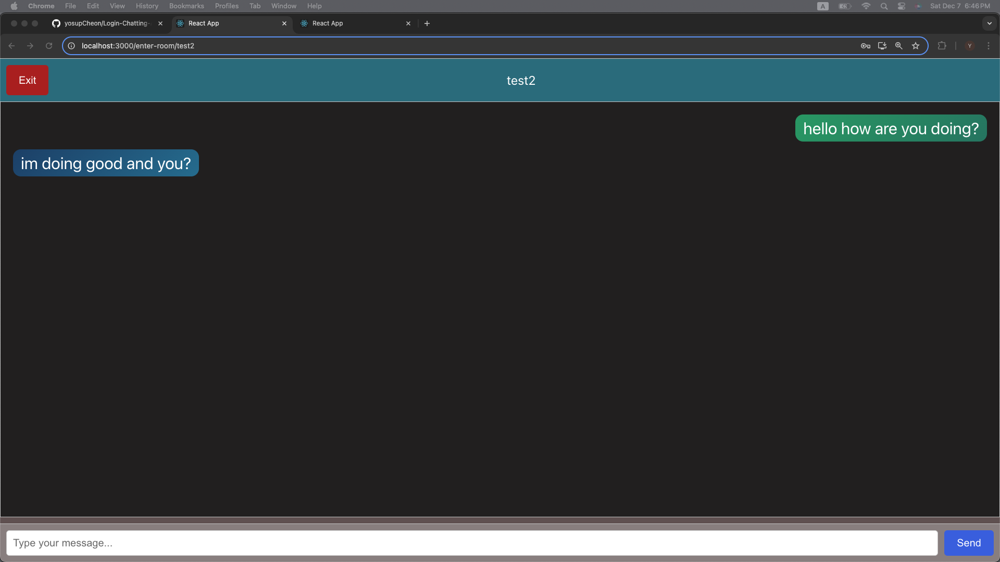

# Talk Space

## Overview
This is Web Chatting Mesasnger that a user can login and chatting with a speific user.

## Basic User Story:
#### User Story 1: User Registration and Login
- As a new user,
- I want to be able to create an account with a unique username and password,
- So that I can access the chat application.
- As a registered user,
- I want to be able to log in to the application using my existing credentials,
- So that I can access my account and start chatting.
#### User Story 2: Chat Room Creation
- As a user,
- I want to be able to create a new chat room,
- So that I can have private conversations with specific users.
#### User Story 3: Chat Room Joining
- As a user,
- I want to be able to join existing chat rooms,
- So that I can participate in conversations with other users.
#### User Story 4: Real-time Messaging
- As a user in a chat room,
- I want to be able to send and receive messages in real-time,
- So that I can have immediate and engaging conversations with other users.

## Preview

This is a login interface where users provide valid credentials to access their accounts.

This is a sign-up interface where users can create an account.  
Each username must be unique; if a username already exists, an error message will be displayed.

This is an options page where logged-in users can either create a new room or join an existing one.

  
  

This is a popup overlay with options to create or join a room.
  

This shows the appearance when a user sends and receives messages.

This shows how it appears on the other user's end.

## Tech Stacks
#### Frontend 
- React (Typescript)
#### Backend
- Node (Typescript/Express)
- Socket.io
#### Database
- MySQL
#### Server
- TBD, but for now test on ngrok

## To Run the Program
- specify the .env file as .env-example
- run "npm install" in both frontend and backend folder
- DB should started
- run "npm start" in both frontend and backend folder

## API Endpoints + Socket communication
#### login (username=String, password=String)
- POST request
- return 200 if success else 400
#### create-user (username=String, password=String)
- POST request
- return 200 if success else 400
#### update_account (username=String, password=String)
- PUT OR PATCH request
- return 200 if success else 400
#### delete_account (username=String, password=String)
- DELETE request
- return 200 if success else 400
#### create-room (hostName=String, roomName=String)
- POST request
- return 200 if success else 400
- validates room names against the database, and connects to the Socket.io server upon successful validation
#### join_room (joinName=String, roomName=String)
- PUT request 
- return 200 if success else 400
- validates room names against the database, and connects to the Socket.io server upon successful validation

## DATABASE Table (MySQL)
### User (add delete and update to api endpoints)
| Column Name | Data Type | Constraints                |
|-------------|-----------|----------------------------|
| id         | INT       | PRIMARY KEY, AUTO_INCREMENT | 
| username    | VARCHAR(50) | NOT NULL     |
| password(hash?)    | VARCHAR(50) | NOT NULL     |
### Room
| Column Name | Data Type | Constraints                |
|-------------|-----------|----------------------------|
| id         | INT       | PRIMARY KEY, AUTO_INCREMENT | 
| username    | STRING OR INT | NOT NULL     |
| room_occupy| INT | CHECK (CONTAINS <= 2)|

## To Create DB
- now running locally (or test with ngrok)
- create .env to define details in db.ts
- and connect db and the backend